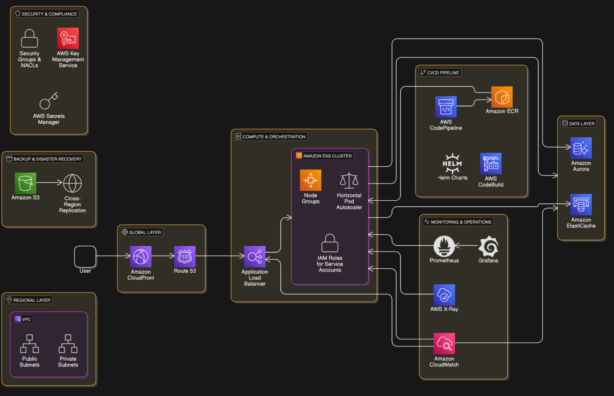

# AWS Infrastructure Diagram




# **Implementation**

## Components and Implemention using Terraform:

### **1. Global Layer (Edge Services)**
- **Amazon CloudFront**:  
  ```terraform
  resource "aws_cloudfront_distribution" "cdn" {
    origin {
      domain_name = aws_alb.alb.dns_name
      origin_id   = "ALBOrigin"
    }
    enabled = true
    default_cache_behavior {
      target_origin_id       = "ALBOrigin"
      viewer_protocol_policy = "redirect-to-https"
    }
  }
  ```
- **Route 53**:  
  ```terraform
  resource "aws_route53_record" "dns" {
    zone_id = "your_zone_id"
    name    = "api.example.com"
    type    = "A"
    alias {
      name                   = aws_alb.alb.dns_name
      zone_id                = aws_alb.alb.zone_id
      evaluate_target_health = true
    }
  }
  ```

### **2. Regional Layer (VPC)**
- **VPC and Subnets**:
  ```terraform
  resource "aws_vpc" "main" {
    cidr_block = "10.0.0.0/16"
  }
  resource "aws_subnet" "public" {
    vpc_id = aws_vpc.main.id
    cidr_block = "10.0.1.0/24"
    map_public_ip_on_launch = true
  }
  resource "aws_subnet" "private" {
    vpc_id = aws_vpc.main.id
    cidr_block = "10.0.2.0/24"
  }
  ```

### **3. Compute & Orchestration**
- **Amazon EKS Cluster**:
  ```terraform
  resource "aws_eks_cluster" "eks" {
    name     = "titan-cluster"
    role_arn = aws_iam_role.eks_role.arn
    vpc_config {
      subnet_ids = [aws_subnet.private.id]
    }
  }
  ```
- **Application Load Balancer (ALB)**:
  ```terraform
  resource "aws_lb" "alb" {
    name               = "eks-alb"
    load_balancer_type = "application"
    security_groups    = [aws_security_group.alb_sg.id]
    subnets           = [aws_subnet.public.id]
  }
  ```

### **4. Data Layer**
- **Amazon Aurora (PostgreSQL)**
  ```terraform
  resource "aws_rds_cluster" "aurora" {
    cluster_identifier = "birthday-db"
    engine            = "aurora-postgresql"
    master_username   = "admin"
    master_password   = "securepassword"
    backup_retention_period = 7
  }
  ```
- **Amazon ElastiCache (Redis)**
  ```terraform
  resource "aws_elasticache_cluster" "cache" {
    cluster_id           = "titan-cache"
    engine              = "redis"
    node_type           = "cache.t3.micro"
    num_cache_nodes     = 1
  }
  ```

### **5. Security & Compliance**
- **Security Groups & Secrets**
  ```terraform
  resource "aws_secretsmanager_secret" "db_secret" {
    name = "db-credentials"
  }
  ```

### **6. Monitoring & Operations**
- **Amazon CloudWatch**
  ```terraform
  resource "aws_cloudwatch_log_group" "eks_logs" {
    name = "/aws/eks/titan-cluster"
  }
  ```

### **7. CI/CD Pipeline**
- **ECR (Docker Registry)**
  ```terraform
  resource "aws_ecr_repository" "repo" {
    name = "birthday-app"
  }
  ```
- **CodePipeline & CodeBuild**
  ```terraform
  resource "aws_codepipeline" "pipeline" {
    name = "birthday-app-pipeline"
    role_arn = aws_iam_role.pipeline_role.arn
  }
  ```

### **8. Backup & Disaster Recovery**
- **RDS Snapshots**
  ```terraform
  resource "aws_rds_cluster_snapshot" "snapshot" {
    db_cluster_identifier = aws_rds_cluster.aurora.id
    db_cluster_snapshot_identifier = "aurora-snapshot"
  }
  ```
- **S3 for Logs & Backups**
  ```terraform
  resource "aws_s3_bucket" "logs" {
    bucket = "titan-logs"
  }
  ```

---

# This Terraform setup ensures a highly available and resilient AWS deployment 🚀

