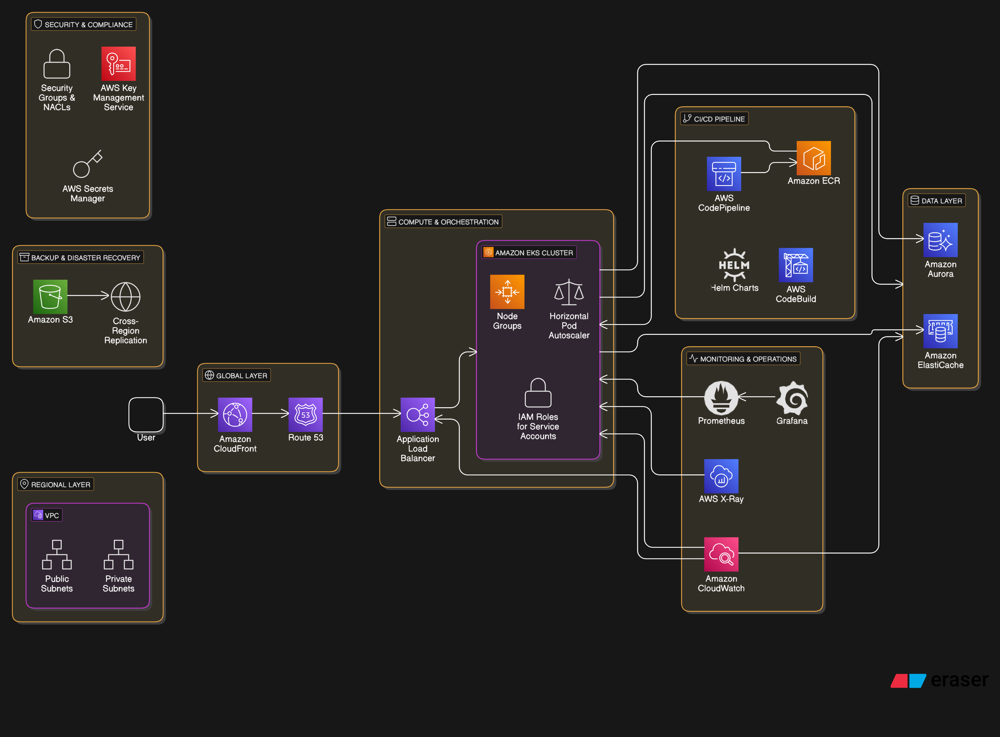

'''

'''

# Architecture Components
'''
# 1. Global Layer (Edge Services)

Amazon CloudFront:

CDN for caching static assets and API responses at edge locations.

Integrated with AWS WAF and Shield for DDoS protection.

Route 53:

DNS management with health checks for failover routing.

'''

# 2. Regional Layer (VPC)

'''

VPC:

Public subnets for internet-facing components.

Private subnets for internal resources.

Multi-AZ deployment across 3 Availability Zones.

'''

# 3. Compute & Orchestration

'''

Amazon EKS Cluster:

Managed Kubernetes cluster in private subnets.

Node groups with Auto Scaling Groups (ASG) for EC2 instances.

Horizontal Pod Autoscaler (HPA) for dynamic scaling.

IAM Roles for Service Accounts (IRSA) for secure AWS access.

Application Load Balancer (ALB):

Routes traffic to EKS pods via Kubernetes Ingress.

SSL termination using AWS Certificate Manager (ACM).

'''

# 4. Data Layer

'''

Amazon Aurora (PostgreSQL):

Multi-AZ relational database with read replicas.

Automated backups with point-in-time recovery.

Amazon ElastiCache (Redis):

In-memory caching for high-throughput API requests.

'''

# 5. Security & Compliance

'''

Security Groups & NACLs:

Restrict traffic between layers (e.g., ALB → EKS, EKS → RDS).

AWS Key Management Service (KMS):

Encrypts data at rest (RDS, EBS, ElastiCache).

AWS Secrets Manager:

Securely stores database credentials.

'''

# 6. Monitoring & Operations

'''

Amazon CloudWatch:

Collects metrics/logs from EKS, ALB, RDS, and ElastiCache.

Alarms for auto-scaling triggers.

AWS X-Ray:

Traces requests across microservices.

Prometheus/Grafana:

Custom Kubernetes monitoring dashboard.

'''

# 7. CI/CD Pipeline

'''

AWS CodePipeline:

Triggers builds on code commits (GitHub integration).

AWS CodeBuild:

Runs tests and builds Docker images.

Amazon ECR:

Stores container images for EKS deployments.

Helm Charts:

Deploy updates to EKS via helm upgrade.

'''

## 8. Backup & Disaster Recovery

'''

## Amazon S3:

Stores Terraform state, application logs, and database backups.

Versioning enabled for rollbacks.

Cross-Region Replication:

RDS snapshots and S3 buckets replicated to a secondary region.

'''

# Data Flow

'''

User → CloudFront (cached response or SSL termination) → Route 53 → ALB.

ALB routes to EKS pods across AZs.

Pods query ElastiCache (cache layer) or Aurora (persistent data).

CI/CD updates trigger CodePipeline → ECR → EKS via Helm.

CloudWatch/X-Ray monitor performance; auto-scaling adjusts resources.
'''

# Resilience Features
'''

Multi-AZ Redundancy: All critical services (EKS, RDS, ElastiCache) span 3 AZs.

Auto-Scaling: Pods (HPA) and nodes (Cluster Autoscaler) scale based on load.

Immutable Infrastructure: Containerized deployments with rolling updates.

Backups: Daily RDS snapshots and continuous S3 versioning.

# Cost Optimization
'''
Spot Instances: For non-critical EKS worker nodes.

Reserved Instances: For long-running RDS/Aurora databases.

Lifecycle Policies: Archive old S3 data to Glacier.

'''

### This architecture ensures high availability, security, and scalability for a mission-critical application on AWS.

'''