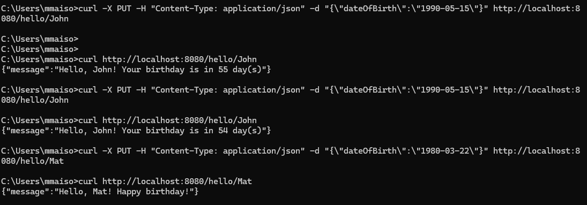

# Problem specification

```
1- Code a simple application that exposes the following HTTP based APIs: 

Description: Save/updates a given user name and date of birth in a database. 

Request: PUT /hello/<username> { “dateOfBrith”: “YYYY-MM-DD” } Response: 204 No Content 

Note: 
Username should only be letters. 
YYYY-MM-DD must be a date before today's date. 

Description: Returns a birthday message. 

Request: Get /hello/<username> Response: 200 Ok Response examples: 

A. If username’s birthday is in N days: { “message”: “Hello, <username>! Your birthday is in N day(s)”} 

B. If username’s birthday is today: { “message”: “Hello, <username>! Happy birthday!” } 

Note: Use the storage or DB of your choice. 

2- Code a simple helm chart and deploy this application into a small local kubernetes cluster (like minikube or k3s) 

3- Produce a system diagram of how this solution would be deployed into AWS. You can consider that the application is of high criticality and high usage, so add

```


# Birthday API Application

A simple Kubernetes-based application that manages user birthdays through REST APIs, deployed using Helm on Minikube.

# Features

- Create/update user birthdays via PUT requests
- Get birthday countdown messages via GET requests
- Persistent SQLite storage
- Health checks for Kubernetes
- Helm chart for easy deployment

# Prerequisites

- [Minikube](https://minikube.sigs.k8s.io/docs/start/)
- [Helm](https://helm.sh/docs/intro/install/)
- [Docker](https://docs.docker.com/get-docker/)
- [kubectl](https://kubernetes.io/docs/tasks/tools/)


# Quick Start

# 1. Clone Repository
```bash

git clone https://github.com/marthymaisog/titanos.git

cd titanos/php-birthday-app

```


# 2. Start Minikube Cluster
```bash
minikube start

eval $(minikube docker-env)  # Use Minikube's Docker daemon

```

# 3. Build & Deploy
```bash

docker build -t birthday-app-python:latest .

helm install birthday-app-python ./helm-chart

kubectl port-forward svc/birthday-app-python-service 8080:5000

```

# Output



# API Documentation

Endpoint	Method	Description	Example Request Body

/hello/<name>	PUT	Create/update birthday	{"dateOfBirth": "1990-05-15"}

/hello/<name>	GET	Get birthday message	-

/health	GET	Service health check	-


# Troubleshooting Guide
Common Errors & Fixes

Image Build Failures

# Rebuild with clean cache
docker build --no-cache -t birthday-app-python:latest .

kubectl patch pvc birthday-app-python-pvc -p '{"metadata":{"finalizers":null}}'

kubectl delete pvc birthday-app-python-pvc --force

# Full cleanup command
helm uninstall birthday-app-python; 

kubectl delete svc birthday-app-python-service; 

kubectl delete secret -l owner=helm

# Reset Minikube networking
minikube ssh -- sudo systemctl restart docker

minikube delete && minikube start

### Upgrade Deployment
docker build -t birthday-app-python:latest .

helm upgrade birthday-app-python ./helm-chart

### Database Operation 

# Export database
kubectl exec deployment/birthday-app-python -- sqlite3 /data/birthdays.db .dump > backup.sql

# Import database
kubectl exec -i deployment/birthday-app-python -- sqlite3 /data/birthdays.db < backup.sql

### Clean Up

helm uninstall birthday-app-python

kubectl delete pvc birthday-app-python-pvc

minikube stop


# 2. Helm Chart 

https://github.com/marthymaisog/titanos/tree/main/php-birthday-app/helm-chart

# 3. AWS Diagram

 https://github.com/marthymaisog/titanos/blob/main/AWS_Diagram.md


